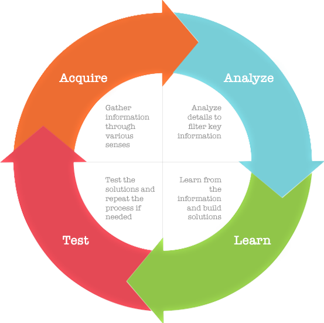

.. Author: Akshay Mestry <xa@mes3.dev>
.. Created on: Friday, August 11 2023
.. Last updated on: Saturday, August 19 2023

.. _demystifying-buzzwords:

##########################
Demystifying the Buzzwords
##########################
.. sectnum:: 

.. authors::
    :affiliations: DePaul University\nJarvis College of Computing and Digital Media\nChicago, IL 60604, USA
    :emails: xa@mes3.dev
    :names: Akshay Mestry
    :links: https://linkedin.com/in/xames3

************
Introduction
************

Hello hello everyone! This chapter will discuss the ideas behind the buzzwords like Artificial Intelligence, Machine Learning, Neural Networks, etc. What do they mean? Since 2010, there has been a massive surge in usage of these words. I have come across a lot of people in my field and outside using them interchangeably. They classify systems as AI-based and some as ML-based. Some often claim a company is an AI-first company. But is the distinction between these buzzwords even correct? Do they mean the same thing or are there any subtle differences? To learn about these terminologies precisely we first need to understand what "Intelligence" and "Learning" means. By intelligence, I am referring to human intelligence. Although different animals display different levels of intelligence, I would primarily focus on our species. These words often connote a similar thing, something to do with knowledge or information. In our world of computer science, we call this information or knowledge, *data*.

******************
Human Intelligence
******************

According to Google...

.. epigraph:: Intelligence is the ability to acquire and apply knowledge and skills to solve a particular problem at hand.

Some say it is the ability to solve complex problems or make decisions with outcomes benefitting the actor using prior knowledge. Some call it a trait, like height or strength. We can keep arguing on what is the right definition and still would not be able to settle on one in particular. But that is not our goal, we want to understand what Intelligence is. So let us go over the definition once again. In simple terms, it means, you learn something and based on that acquired information you do something. Now, what you learn or how you learn is a different subject or what you do with the information or how you use that information depends on the context of the problem. But the key insight is you first learn about something and then you apply your knowledge.

|tab| This is how we humans and some mammals tend to function. Over our lifetime we spend time learning and adapting to new information as we grow and later use it for carrying out some activity. This is Intelligence at work. Like memories, intelligence is not a single thing located in some part of our brain. The concept of intelligence :abbr:`i.e. (that is)` analyzing, learning, adapting and using the information wisely, is something we as a species have developed throughout thousands of years through evolution. It took us a lot of time to develop this level of intellect which we now take for granted. Let me explain this with a very simple example. Imagine early humans learning to use sticks and twigs for self-defence. They used bamboo sticks or dried tree branches to cast off predators. When this method of intimidation became ineffective as the predators also learnt to adapt, these early humans started modifying their tools. They would sharpen the tips of the branches or light the stick on fire. They started using their resources more effectively to yield better results. Another example would be touching a hot surface, we all have been there. Imagine yourself accidentally touching something hot to your touch, you instinctively quickly pull yourselves from it. Once you register the fact that touching a hot thing would harm you, you now become more cautious and aware of your next actions. You adapt to the new information.

    Intelligence as a collective process of various stages

|tab| Our survival instincts as a species led us to develop this intellect and thus over the years it kept on improving. It is extremely important to remember that this way of figuring out a solution to a problem probably took us a very long time. But over time, our species understood the problem at hand, learnt and found a way around it. With time, we adopted different strategies and kept improvising. Now, it is often debated amongst many scientists and researchers how to measure or what intelligence is. To make matters worse, intelligence is also connected to consciousness since awareness is helpful in problem-solving. This process collectively is Intelligence. Understanding a problem statement or being aware or conscious of a situation, prototyping a solution based on experience, testing it out and improvising based on failures is how we learn. So intelligence is a set of actions that we do harmoniously to get something done.

****************
General Learning
****************

In simple terms, learning is a process of gathering and understanding information about something through senses such as vision, sound, smell, touch or taste. It is like intelligence but not completely. Intelligence is a collective process of learning and navigating our actions based on acquired knowledge. Whereas learning is a subset or part of the intelligence *process* wherein you try to gather more information, understand your problem and work on expanding your experiences about a particular subject. The gathered information about a subject through our senses is the basis of the next actions for learning. Without any information about a topic, we are unable to react appropriately or flexibly. Thus, having adequate information plays a significant role while learning. But only having information is not enough, we need to store it in memory too.

|tab| While learning something, saving information in the memory is crucial. Memorization is the ability of the mind to save and recall information so that a living being does not have to start from scratch every time it perceives something relevant. For example, consider a toddler. A toddler is perhaps one of the best examples to explain how learning works. A toddler learns to walk on its twos after a lot of repetitive trial and error, trying different manoeuvrings and memorizing actions and elements which worked along the way until it masters them.

.. figure:: ../img/toddler-learning-to-walk.png
    :alt:  A toddler learning to walk in multiple stages

    A toddler learning to walk throughout the multiple stages of its life

It starts by trying and learning to roll over its belly. This initial process takes some time for the little one as it is a new experience for him. Once it can transition from its back to belly seamlessly, it tries various gestures and learns to use its tiny little hands and feet to crawl like a commando thus moving forward or backwards. Once it is comfortable crawling, it starts using its feet for faster movements and starts using its knees. This is where it starts learning how to stand on twos. Initially, all its attempts to stand straight fail but with time and enough practice, it learns to hold itself without support. Once it is comfortable standing, it starts taking its first little steps. This is nothing but learning, a process of putting together a sequence of thoughts or actions. The toddler uses its little intellect to learn its way to stand and walk. It repeats its behaviours and adapts to new information. While learning to walk, it learns to sit and jump too simultaneously. The toddler understands the significance of sitting and jumping through their past experiences and how these activities aid in moving.

|tab| The act of learning is not restricted to humans. Almost all animals exhibit this behaviour. Humans and terrestrial mammals learn to walk and swim while birds learn to fly. A lot of this learning seems quite intuitive and hard-wired in our brains. We do not have to teach babies to walk or birds to fly. They do it based on their instincts. Researchers are not sure why this behaviour feels so natural though or maybe this is the intelligence of a species at work.

*************************
Intelligence v/s Learning
*************************

To summarize, intelligence is simply a collective process of problem-solving using various elements while learning is the process of gathering information through repetitive trial and error and building this intellect. Of course, there are other things like planning, creativity, rationalization, socializing, etc which are also some of the overlapping components while speaking of intelligence and learning. But we will focus on them later. While learning and building intelligence, it is crucial to understand what is necessary for problem-solving. Intelligence is merely a toolbox which holds various tools like analyzing, learning, testing and adapting whereas Learning itself is a tool. All we need to do is learn how to use them effectively.

|tab| I will try to explain the significance of applying intelligence and learning through a simple example. Animals like squirrels hoard their food for cold weather but cattle do not exhibit this behaviour. Through evolution, these animals have learnt their survival strategies. After a lot of trial and error, a squirrel has learnt that if it does not store enough food for colder weather it might not get sufficient food later. It had learnt this over thousands of years and thus has built enough intelligence to selectively hoard enough food for itself. On the other hand, consider a domesticated cow which does not worry about food in the cold weather. It lives in a group, a cattle. So for a cow, socializing plays a critical role in survival. The cow has learnt that if it stays with humans, it will be well fed irrespective of the weather. For the cow, the learning curve has stopped.

.. figure:: ../img/animals-survival-by-food.png
    :alt:  Cow vs Squirrel

    A cow enjoying its social life grazing through the meadows whilst a squirrel needs to work hard

The whole point of the above example is to make sure you understand where to focus your time and resources while building solutions. You as an engineer need to understand why are you developing something and how will it be used in real-world applications. You need to understand what you need rather than what you want. Do you need AI or ML? This is the question one must ask itself before venturing ahead.

***********************
Artificial Intelligence
***********************

If you understand the concept of human intelligence correctly, this is a no-brainer. To re-iterate, intelligence is the process of analyzing, understanding and learning about the available information and then prototyping a solution to the problem. Artificial Intelligence is the same thing but something that is simulated artificially by humans. When talking about AI, we talk about a system that is capable of comprehending and adapting to the presented problem and then finding a solution for it. It functions similarly to the intelligence exhibited by living entities |dash| acquiring information through senses, learning over time through repetitive variations and testing its outcomes against the problem to reward itself. This is what an AI is. It is a system that simulates a living entity (not necessarily a human but close) artificially. Here the term artificial implies something that is designed or programmed by humans and which is inherently not created naturally.

|tab| In lay terms, it is a system. Now the term system is used loosely in this context and can be defined in many different ways. It can be a computer program, a dedicated mesh of computer networks that talk to each other or some robotic framework for a particular task. So to define AI in simple terms, Artificial Intelligence is a system that is capable of simulating near-human intelligence or function like a human to solve a problem. Since the last decade, a lot of these AIs have been developed and now there has been a variety of these AIs out there like AIs playing games or AIs conversing with humans, etc. But at its core, these are nothing but machines or systems designed by humans to perform *a certain task*. We call these AIs, Artificial Narrow Intelligence or ANIs. There is another type of AI called Artificial General Intelligence or AGI. Both ANIs and AGIs are marvellous and extremely sophisticated in their designs but extremely difficult to build.

|tab| Almost all the AIs that are out there are examples of ANIs. They do perform similarly to humans to an extent but their reach is limited to a particular field or task. They cannot solve problems which they are not trained to solve. Whereas an AGI is a super-intelligent system that can act using its "subconscious" state to understand, debug and solve the problem. Unfortunately, AGIs don't exist yet. A researcher from Google claims they have seen their AI become conscious or sentient in its action but I believe it is far from truth. I am not saying that AGIS can't exist, what I am saying is it is very unlikely that we will hear about them sooner than we anticipate. Sure, the AIs that we have developed now are certainly capable of surprising us with the answers they provide to the complicated problems which we throw at them.
